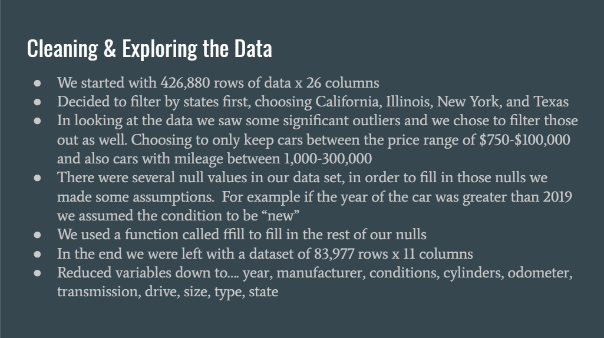
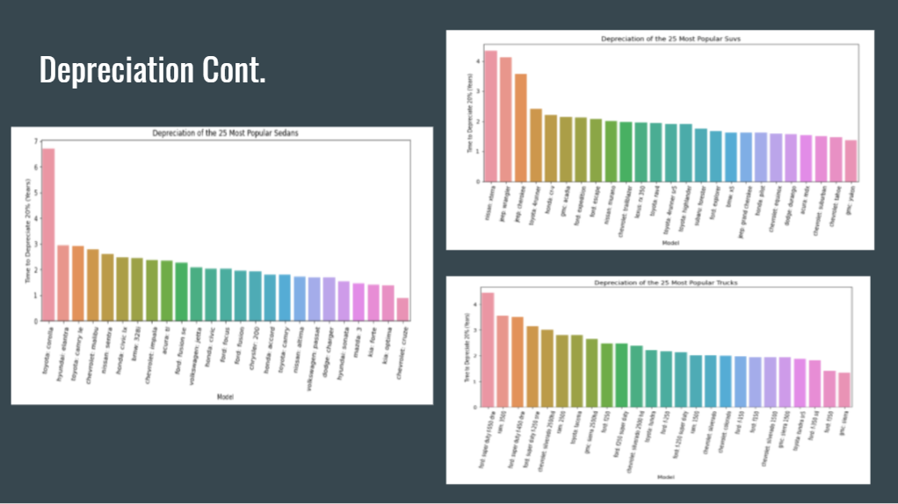
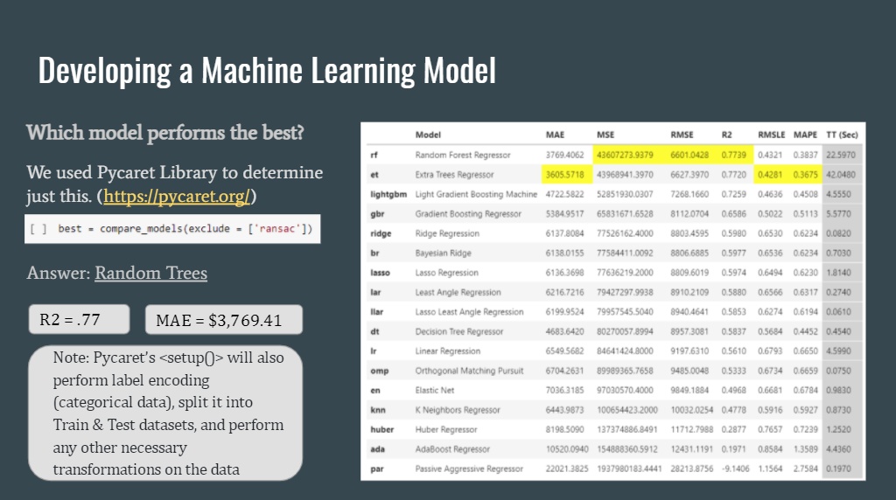
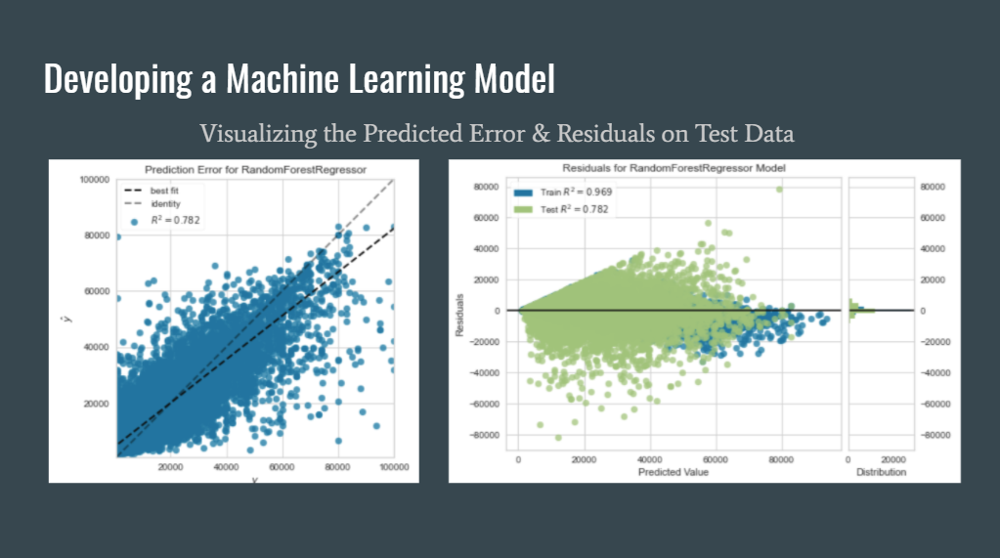
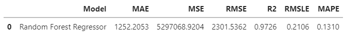
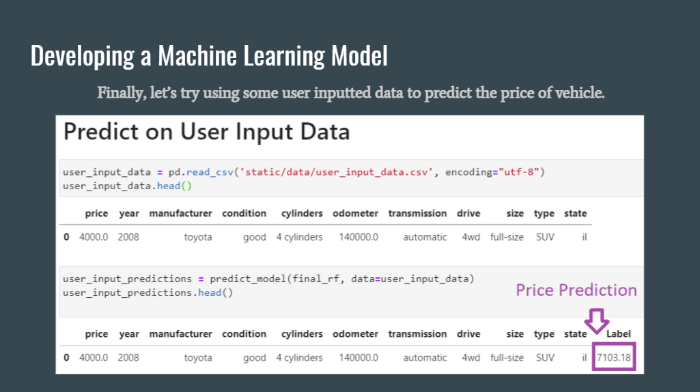

# Used-Car-Price-Predictor-and-Analysis
Machine Learning Project meant to take used car data and predict prices.  Paired with an analysis of our learnings.

This project was created by:

* J.D. Strode [Github Profile](https://github.com/jdstrode)
* Amy Barba [Github Profile](https://github.com/abarba1914)
* Vaidehee Shah [Github Profile](https://github.com/vaideheeshah13)
* Kiril Ivanov [Github Profile](https://github.com/ivanovteam)

Out team has built a machine learning model to predict used car prices.  We utilized a kaggle dataset to build the model and identify which variables are most important to predicting price.

[View a Final Presentation of the Project](https://docs.google.com/presentation/d/16_Rtap44-j0j7Cy9LQtGQUKX3_1HHcAX5m7XczP146I/edit?usp=sharing)

## Tools / Languages: 
Python, Pandas, Pycaret, Scikit-Learn, Seaborn, Tableau, BeautifulSoup, Matplotlib, Jupyter Lab, Visual Studio Code, Github.

## How to Utilize the Model? 
1) Open the file titled "user_input_data.csv" in the /static/data directory.
2) Input the vechicle and specifications you wish to analyze.  IMPORTANT: Be sure to input in the same format as example data.
3) Open and run the file titled "load_model_and_predict.ipynb"
4) Note: the .pkl file where the model is stored may be inaccessible due to file size and limitations of Github.  User can run the "create_model_using_pycaret.ipynb" in order to create a fresh model on their local machine.

## What is in this Repository? 
* Several cleaning files for sorting our initial Kaggle Data
* A fully customizable webscraper to scrap your car data from the city(s) of your choice.  Note: this data will need to be formatted to fit the model.
* A file containing the Pycaret code used to build and test the model. 
* Images of the outputs from the analysis and modeling
* .csv files of the outputs from the analysis and modeling
* Various sample data sets used to build the model

Note: the initial Kaggle dataset was narrowed down to only four (4) states (IL, CA, TX, NY) to minimize the data used. This file is named cars_cleaned_sample.csv.

## Cleaning the Data

## Data Analysis & Take-aways (sample example(s) from presentation)

## Machine Learning Model Results?  

### Which Model is best? (Random Forest)

### Measuring the Final Model's Predictive Capabilities 

### Predicting User Inputted Data

## Inspiration for this project

1) https://towardsdatascience.com/predicting-used-car-prices-with-machine-learning-techniques-8a9d8313952
2) https://medium.datadriveninvestor.com/end-to-end-project-on-used-car-price-prediction-3dc412d24aa0
3) https://github.com/AustinReese/UsedVehicleSearch
4) https://github.com/geoprism/Cars.com-webscraper
5) https://medium.com/analytics-vidhya/scraping-car-prices-using-python-97086c30cd65

## Dataset 

[Kaggle Dataset](https://www.kaggle.com/austinreese/craigslist-carstrucks-data)

## Tableau Exploration

[Tableau Public File](https://public.tableau.com/shared/6K243HZWT?:display_count=n&:origin=viz_share_link)